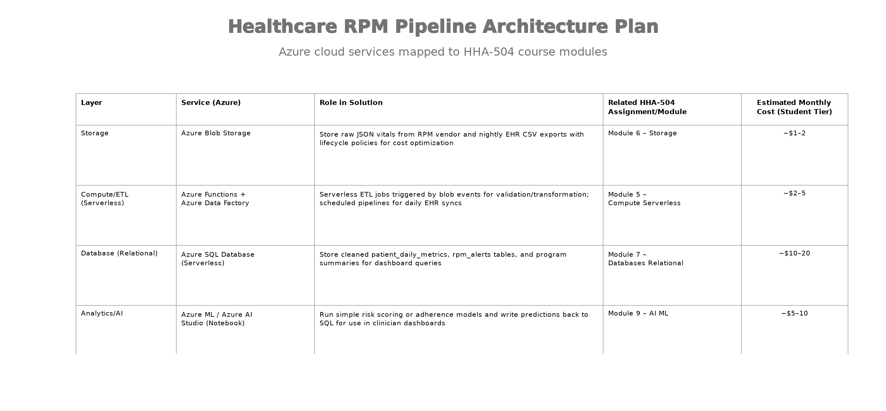

## Architecture & Implementation Plan

### 1. Service Mapping

### Data flow narrative
1. Patient vitals arrive as JSON payloads from RPM vendor API → land in Blob Storage "raw-vitals" container via HTTP-triggered Azure Function.​

2. Blob event trigger fires serverless Function to validate readings (range checks, duplicates) → writes clean data to "validated-vitals" container.​

3. Nightly Data Factory pipeline ingests EHR CSV exports (patient demographics, enrollment) → joins with vitals → computes daily metrics and alerts → loads to Azure SQL.​

4. SQL stored procedures run rule-based alerting (for example, systolic >160 on 2/3 readings) → populate rpm_alerts view for real-time queries.​

5. Streamlit app (Container Apps) queries SQL views → serves nurse worklists and physician trend dashboards with embedded Power BI charts.​

6. Program dashboard aggregates enrollment/control metrics for clinic leadership via scheduled SQL views refreshed by Data Factory.

### 3. Security, Identity, and Governance
All services use Azure Managed Identity for authentication—no stored credentials or service principals needed, following HHA-504 credential management best practices (Module 2). Role-Based Access Control (RBAC) assigns least-privilege roles: Data Factory gets Storage Reader/Writer + SQL Contributor; Streamlit/Container Apps get SQL Reader only; no direct Blob access for reporting apps.​

PHI de-identification strategy: Raw JSON/CSV contain only research-identifiable info per HHA-504 data ethics guidelines. Production would map IDs via secure token service before SQL load. All data stays within VNet-integrated services; public endpoints disabled. Audit logs via Azure Monitor track all access/transformation for compliance demos.​

### 4. Cost and operational considerations

Primary costs: Azure SQL Serverless (~60% budget) due to frequent dashboard queries; Data Factory/Functions scale to near-zero during low activity. Blob Storage minimal ($0.02/GB) with Cool tier + 30-day lifecycle to archive old vitals. Total stays under $30/month on student free tiers by using consumption pricing everywhere—no provisioned VMs.​

Student optimizations: Azure Functions Premium (cold-start optimized) for ETL; SQL Serverless auto-pauses idle databases; Data Factory triggers only on blob events/schedules vs. continuous runs; Power BI Pro shared workspace ($10/user). GitHub Actions deploys infrastructure-as-code. Monitor via Azure Cost Management alerts at $20 threshold. Scale to zero during semester breaks via scheduled shutdowns